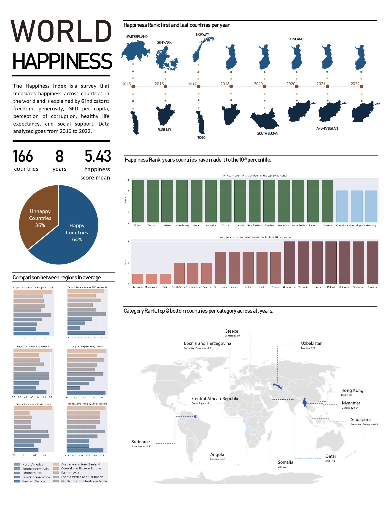

EDA & Regression Models on World Happiness
==============================

This project curates and unifies all World Happiness datasets, including the last one available from 2022. An extensive data cleaning process is done, and afterwards exploratory analysis is used to find insights from the data. Regression is used to tackle missing values imputation and build predictive models, these are evaluated and compared. 

This repository extends the current work available online and aims to predict World Happiness for 2023. 

The results of this study will be published on my personal
[blog](https://gabrielarscp.wixsite.com/gabsdatascience/blog).

## Roadmap

- Collect World Happiness datasets from the last years.
- Curate old datasets and homogenize fields to unify all sources in one.
- Check for faulsy values.
- Impute missing values.
    - Try out various regression techniques.
    - Compare techniques looking at distributions or doing cross validation.
    - Apply the best one.
- Do exploratory data analysis and examine:
    - Correlation between variables (Identify highest correlated variables).
    - Category with higher impact in the Happiness Score.
    - Distribution of Happiness Score.
    - Top/bottom 10 countries in the podium for the last 8 years.
    - Top/bottom 10%til countries in happiness.
    - Overall best performing country in each category by average.
    - Evaluate regions performance in each category by average.
- Comparison between regression models.
- Build predictive models using regression.
    - Compare results evaluating with appropiate metrics. 
    - Models tuning.
- Do predictive extrapolation using time series on the data and analyze (Future Work):
    - Rank in 2023
    - Which country is on it’s way to becoming the first Utopia? (>9.0) 
    - Which country is on it’s way to becoming the first Dystopia? (<1.0)
- Create infographic.

## Python Stack

**Math & Machine Learning:** sklearn, numpy.

**Data Manipulation:** pandas (for datasets), requests (for web scrapping).

**Visualization:** mathplotlib, seaborn (newest interface 'objects'), geopandas.

## Data Stack

- Data cleaning and feature engineering.
- Exploratory data analysis.
- Machine learning algorithms: regression algorithms like Linear, Ridge, Lasso, and Polynomial Regression, Stochastic Gradient Descent, SVR, Regression Tree, Random Forest, and Neural Networks. 
- Model evaluation and tuning.
- Visualization plots.

## File Description

To structure my project I have followed the *Cookiecutter* template.

    ├── LICENSE
    ├── README.md          <- The top-level README for developers using this project.
    ├── data
    │   ├── maps           <- Geo data.
    │   ├── interim        <- Intermediate data that has been transformed.
    │   ├── processed      <- The data sets for modeling.
    │   └── raw            <- The original, immutable data dump.
    │
    ├── notebooks          <- Jupyter notebooks
    │   ├── 1.data_wrangling.ipynb          
    │   ├── 2.feature_engineering.ipynb     
    │   ├── 3.exploratory_analysis.ipynb     
    │   ├── 4.regression_models.ipynb
    │   ├── 5.prediction_2023.ipynb
    │   └── 6.maps_visualization.ipynb
    │
    ├── references         <- Explanatory materials.
    │
    ├── reports            <- Generated analysis as HTML, PDF, png, LaTeX, etc.
    │   ├── figures        <- Generated graphics and figures to be used in reporting
    │   └── maps           <- Generated maps to be used in reporting
    │
    ├── setup.py           <- Makes project pip installable (pip install -e .) so src can be imported
    ├── src                <- Source code for use in this project.
    │   ├── __init__.py    <- Makes src a Python module
    │   │
    │   ├── data           <- Scripts generate dataset
    │   │   ├── make_dataset.py
    │   │   └── wh_dataset.py
    │   │
    │   ├── features       <- Scripts to turn raw data into features 
    │   │   ├── build_features.py
    │   │   └── impute_missing_data.py
    │   │
    │   ├── models         <- Scripts to train models and then use trained models to make
    │   │   │                 predictions
    │   │   ├── linear_regressors.py
    │   │   ├── non_linear_regressors.py
    │   │   ├── regressors.py
    │   │   └── transformers.py
    │   │
    │   └── visualization  <- Scripts to create exploratory and results oriented visualizations
    │       └── visualize.py
    │
    └── requirements.txt   <- The requirements file for reproducing the analysis environment 

## Datasets
### World Happiness
The World Happiness Report is a landmark survey of the state of global happiness that ranks 156 countries by how happy their citizens perceive themselves to be. 

Unfortunately, my home country Cuba is not in the countries analized. 

*Name*: World Happiness Report

*Source*: https://www.kaggle.com/datasets/mathurinache/world-happiness-report

*Institution*: Gallup World Survey

*Date*: 2022-03 

#### Factors that explain the Happiness Score
The Happiness Score is explained by the following factors: GDP per capita, Healthy Life Expectancy, Social support, Freedom to make life choices, Generosity, Corruption Perception, Residual error

### Geolocation
*Name*: Countries geolocation data

*Source*: https://gadm.org/download_country.html

*Date*: 2023-01 

## Results
- Data Wrangling Stage:
    - Unified source for all years - World Happiness index datasets.
    - Includes happiness score, rank, year, country, region, and features that explain happiness.
- EDA Insights:
    - Happiness Score is highly correlated to GDP, social support and healthy life expectancy. 
    - Most countries are happy.
    - Happines tends to grow each year very slowly.
    - The happiest regions in order are: Australia and New Zealand, North America and Western Europe.
    - The unhappiest regions are Southern Asia and Sub-Saharan Africa.
    - The happiest countries are Finland, Denmark, Switzerland, Norway, Iceland.
    - The unhappiest countries are Rwanda, Tanzania, Afghanistan.
- Regression models:
    - Linear Regression shows better performance for the data.
    - Regression Forest would be second place.

## Future Work
- EDA: 
    - Examine if population size and Happiness Score are correlated.
    - Identify if there is causal effect between Happiness Score and Wealth/Health.
- Time series Prediction

## Last Update
2022-01-16 by Gabriela Rodriguez

## 🔗 Links

--------

<small>Project based on the <a target="_blank" href="https://drivendata.github.io/cookiecutter-data-science/">cookiecutter data science project template</a>. #cookiecutterdatascience</small>

<!-- ├── Makefile           <- Makefile with commands like `make data` or `make train` -->
<!-- ├── models             <- Trained and serialized models, model predictions, or model summaries -->
<!-- (pip freeze > requirements.txt) -->
